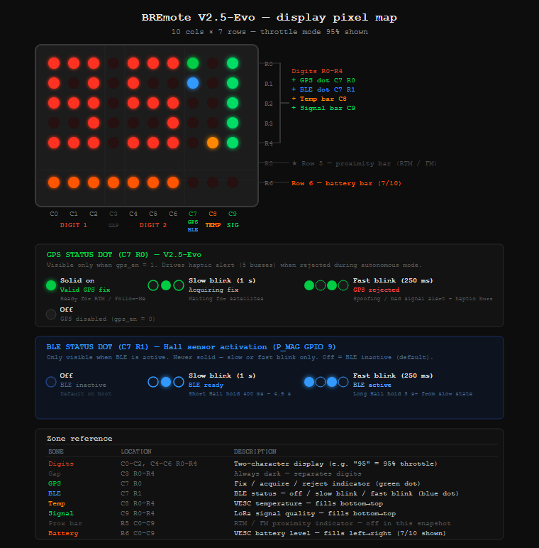

# BREmote V2.5-Evo — Tow Buggy / eFoil Remote

> **Fork of [BREmote V2](https://github.com/Luddi96/BREmote) by LudwigBre / Luddi96**

[](https://github.com/Luddi96/BREmote)
[](https://github.com/Janrusher)
[](https://github.com/monterman)

ESP32 LoRa wireless remote for efoil and RC tow buggy — 868/915 MHz, 10 Hz control cycle, VESC UART telemetry, GPS speed display, integrated data logger.

**Status: Pre-Alpha — not yet field-tested on the water. See Alpha Testing Notes below before any in-water use.**

---

## Credits

BREmote is a collaborative open-source project built by the efoil and esk8 community:

| Contributor | Contribution |
|---|---|
| **[LudwigBre / Luddi96](https://github.com/Luddi96/BREmote)** | **Original hardware design, original firmware architecture, project founder, and dev-logger framework (dev-logger branch). All core features originate here.** |
| **Janrusher** | Dynamic throttle cap mode and Web Console foundation — significant V2 enhancements forked from LudwigBre, further refined in V2.5-Evo |
| **monterman** | V2.5-Evo firmware: TX GPS implementation, dev-logger AUX button toggle with LED status feedback (5× flash = start, 2× flash = stop), date format DDMMYY → MMDDYY, web console major rebuild (upload/download/compare JSON, integrated serial console, TX+RX coverage, plain-English parameter docs for every setting), deep codebase analysis, critical bug documentation, RTM/FM mode design |

This fork exists because LudwigBre published open hardware and firmware under GPL 3.0. V2.5-Evo enhancements are released under the same license and dedicated back to the community.

---

## What Is This?

BREmote is a custom wireless remote system for efoils and RC tow buggies. The TX (handheld) sends throttle and steering over LoRa at 10 Hz. The RX (mounted on the vehicle) drives the ESC/VESC and returns telemetry.

```
┌────────────────────────────┐              ┌──────────────────────────────────┐
│      TX — Handheld         │              │       RX — Board Unit            │
│                            │              │                                  │
│  ESP32-C3                  │              │  ESP32-C3                        │
│  SX1262 LoRa               │◄──────────►  │  SX1262 LoRa                     │
│  BN-220 GPS (GPIO 18/19)   │  868/915MHz  │  BN-880 GPS  (Serial1 + I2C mux) │
│  Dot matrix display        │    10 Hz     │  QMC5883L Compass  (I2C)         │
│  Hall-effect throttle      │  6-byte pkt  │  AW9523 I/O Expander (I2C)       │
│  Hall-effect toggle        │              │  VESC UART  or  ESC PWM output   │
│  Vibration motor           │              │  Servo steering output           │
│  WiFi AP — web config      │              │  WiFi AP — web config + log DL   │
│                            │              │  Flash Data Logger               │
└────────────────────────────┘              └──────────────────────────────────┘
```

---

## What's New in V2.5-Evo

| Feature | V2 | V2.5-Evo |
|---|---|---|
| TX GPS speed display (mph / km/h / knots) | ❌ | ✅ |
| GPS speed source SPIFFS-configurable | ❌ | ✅ |
| Data logger AUX button toggle + LED feedback *(logger by LudwigBre)* | ❌ | ✅ |
| Log download over WiFi web UI | ❌ | ✅ |
| US-format log filenames (MMDDYY) | ❌ | ✅ |
| Web Serial Config Tool (offline HTML, USB serial) | ❌ | ✅ |
| Full codebase audit + stability fixes (7 critical) | ❌ | ✅ |
| GPS anti-spoofing: Phase A (RX standalone) | ❌ | ✅ |
| GPS anti-spoofing: Phase B (TX↔RX handshake) | ❌ | ✅ |
| GPS anti-spoofing: Phase C (RTM convergence) | ❌ | ✅ |
| TX→RX GPS coordinate meta-packets (0xF3) | ❌ | ✅ |
| Return-to-Me mode (RTM) | ❌ | ✅ |
| Follow-Me mode override (FM) | ❌ | ✅ |
| RTM/FM info display (distance/speed on TX) | ❌ | ✅ |

---

## Hardware Requirements

| Component | TX (Handheld) | RX (Board Unit) |
|---|---|---|
| MCU | ESP32-C3 | ESP32-C3 |
| Radio | SX1262 LoRa | SX1262 LoRa |
| GPS | BN-220 or [HGLRC M100 Micro](https://www.hglrc.com/products/hglrc-m100_mini-gps) (M10 chip, no compass, 3.3V–5V) | BN-880 or [HGLRC M100-5883](https://www.hglrc.com/products/m100-5883-gps) (M10 chip + compass) |
| Compass | None | QMC5883L (I2C) |
| Display | HT16K33 dot matrix (I2C 0x70) | None |
| ADC | ADS1115 (I2C 0x48) | None |
| I/O Expander | None | AW9523 (I2C) |
| ESC / VESC | None | VESC UART or PWM (RMT GPIO 9) |

> ⚠️ **TX GPS must be 3.3V tolerant** — the ESP32-C3 supplies 3.3V only. Both the BN-220 and HGLRC M100 Micro meet this requirement.

---

## Quick Start

1. **Flash firmware** — use the Flash Download Tool (link below) or Arduino IDE
2. **Power on both TX and RX** — TX shows `EP` (not paired) on first boot
3. **Pair** — hold RIGHT toggle on TX at boot; hold BIND on RX at boot simultaneously
4. **Connect to WiFi AP** — SSID shown on the device; default password `12345678`
5. **Open the Web Serial Config Tool** — configure all parameters with plain English labels
6. **Calibrate TX** — hold LEFT toggle at boot, follow the display prompts

---

## 🛠️ Web Configuration Interfaces

BREmote V2.5-Evo has three separate web configuration interfaces:

### 1. TX Embedded Web Page
Served by the TX WiFi AP for the first 120 seconds after boot. Connect to the TX WiFi AP and open the device IP in any browser. Configures all TX SPIFFS parameters with valid range hints.

### 2. RX Embedded Web Page
Served by the RX WiFi AP for the first 120 seconds after boot. Configures all RX SPIFFS parameters and provides log file management (list, download, delete).

### 3. BREmote V2.5-Evo — Web Serial Config Tool *(standalone, offline)*

The most capable interface. Connects to TX or RX via USB serial (requires Chrome or Edge).

**Open directly — no download needed:**
[https://monterman.github.io/BREmote-V2/BREmote_V2.5-Evo_Web_Serial_Config_Tool.html](https://monterman.github.io/BREmote-V2/BREmote_V2.5-Evo_Web_Serial_Config_Tool.html)

**Or download for fully offline use:** [`docs/BREmote_V2.5-Evo_Web_Serial_Config_Tool.html`](docs/BREmote_V2.5-Evo_Web_Serial_Config_Tool.html)

**What it does:**
- Configure both TX and RX — switch between boards without leaving the page
- Upload / download / compare two configurations side by side
- Integrated serial console with custom commands dropdown
- Extensive plain-English descriptions for every parameter — you know what each setting does and its valid range before you change it
- Export config as **JSON** or **Base64** (for serial paste)
- Log file download and management
- Dirty-state highlighting — changed fields highlighted until saved
- Works fully offline after download

---

## TX Features

### Standard Features (V2)

- Hall-effect throttle with calibration
- Hall-effect toggle for steering and gear/menu input
- Dot matrix display showing telemetry modes
- LoRa packet transmission at 10 Hz
- Gears mode, no-gears mode, dynamic throttle cap mode
- Configurable throttle expo curve
- System lock / unlock sequence
- Vibration motor feedback
- Internal battery voltage monitoring
- USB charging detection and display
- Pairing with address-based authentication
- WiFi AP for web configuration
- Serial USB configuration interface (`?conf`, `?conf json`, `?tasks`, etc.) — also configurable via the [BREmote V2.5-Evo Web Serial Config Tool](https://monterman.github.io/BREmote-V2/BREmote_V2.5-Evo_Web_Serial_Config_Tool.html), which is easier than raw serial and includes plain-English descriptions for every parameter

### V2.5-Evo: TX GPS Speed Display

The **SP** (Speed) telemetry display mode can now read speed directly from the TX GPS module (BN-220 on Serial1), eliminating dependence on the LoRa telemetry round-trip. Configure `speed_src` in Config Studio or the web UI:

| `speed_src` | Source | Unit | Status |
|---|---|---|---|
| 0 | RX GPS | km/h | V2 original |
| 1 | RX GPS | knots | V2 original |
| 2 | TX GPS | km/h | ✅ V2.5-Evo |
| 3 | TX GPS | knots | ✅ V2.5-Evo |
| 4 | RX GPS | mph | ✅ V2.5-Evo |
| 5 | TX GPS | mph | ✅ V2.5-Evo |

Display shows `--` when no fix is available or the fix is older than the configured stale timeout. Set `gps_en = 1` and reboot after changing it.

**Telemetry display cycle** (cycle with LEFT toggle hold 2 s):

```
TH       → UB           → TP    → SP    → PV    → BA
Throttle → Internal Bat → Temp  → Speed → Power → Foil Bat
```

**PV** shows VESC battery-side power in kW with one decimal (e.g., `4.4` = 4400 W). Capped at 9.9 kW.

### TX Toggle Button Reference — V2.5-Evo P8 Gestures

| Input | Result |
| --- | --- |
| Boot + hold LEFT toggle | Calibration mode |
| Boot + hold RIGHT toggle | Pairing mode |
| Boot + THR + LEFT toggle | USB charging mode |
| Boot + THR + RIGHT toggle | Delete SPIFFS config (factory reset) |
| LEFT tap (quick) | Arm combo window — next RIGHT hold within 3 s triggers FM |
| RIGHT tap (quick) | Arm combo window — next LEFT hold within 3 s triggers RTM |
| LEFT hold 2 s | Cycle telemetry display mode |
| RIGHT hold 2 s | Reserved — no action |
| RIGHT tap → LEFT hold 5 s | Arm **Return-to-Me** (RTM) — display shows `rn` |
| LEFT tap → RIGHT hold 5 s | Cycle **Follow-Me** override mode (F0/F1/F2/F3) |

> **Note:** The lock feature has been removed in V2.5-Evo. The system always boots unlocked. Throttle must be at 0 for long-press actions to fire.

---

## RX Features

### Standard Features (V2)

- VESC UART telemetry (battery %, FET temperature, speed, power)
- Single motor, differential motor, or servo steering output
- PWM output via RMT (GPIO 9) and AW9523 I/O expander
- Water ingress detection with safety stop
- Configurable failsafe time (motor stop on LoRa link loss)
- Foil battery cell count and voltage monitoring
- BMS detection
- GPS positioning (BN-880)
- QMC5883L compass (I2C, fully implemented — heading used by RTM auto-steering)
- Kalman filter on GPS data
- Follow-me mode framework (positional modes: behind, near right, near left)
- WiFi AP for web configuration and log management

### V2.5-Evo: Data Logger *(framework by LudwigBre — AUX toggle by monterman)*

The RX board logs GPS position, VESC telemetry, voltage, speed, and timestamps to on-board flash storage.

> **Keep `logger_en = 0` (the default).** Use the AUX button to start and stop individual logging sessions. If you set `logger_en = 1`, the logger starts automatically on every boot and logs continuously — not recommended, as it fills flash quickly and runs without GPS-lock confirmation.

**Starting and stopping a session:**

| Action | LED | Meaning |
|---|---|---|
| Press AUX once | 5× flash | Logging session started |
| Press AUX once again | 2× flash | Logging session stopped |

**Tips:**
- **Wait for GPS lock** before pressing AUX — entries without a valid fix record zero coordinates
- **WiFi auto-disables** while logging to reduce current draw and RF interference with GPS
- **Brownout warning:** the logger auto-stops if supply voltage drops below threshold; WiFi + logging together draw significant current — ensure adequate power supply
- **File format:** `MMDDYY_HHMMSS.csv` (UTC, US date order) *
- **Download:** Connect to RX WiFi AP → open the RX embedded web page or the Web Serial Config Tool → **Manage Logs** section

*\* Date format changed from DDMMYY (original LudwigBre) to MMDDYY in V2.5-Evo.*

---

## 🛡️ Safety Philosophy

> **The Tow Buggy ONLY moves when the user physically holds the throttle trigger.**

This rule is non-negotiable and is enforced at the firmware level — it cannot be configured away:

- Autonomous assist modes can **only subtract from throttle** — they can never add to it
- Releasing the throttle trigger stops the buggy **immediately**, regardless of any active mode
- No loiter, no station-keeping, no position hold, no autonomous parking
- Return-to-Me and Follow-Me can adjust steering and reduce throttle — they cannot independently spin the motor
- Without active user throttle input, the buggy motor **never moves** under any circumstance

---

## Return-to-Me (RTM) — Full Guide

> RTM is fully implemented in V2.5-Evo. Hardware: GPS on both TX and RX, compass on RX.

> **Display note:** The TX dot matrix shows lowercase **`rn`** while Return-to-Me is active. `rn` = Return to Me = RTM. All SPIFFS parameters and code use the `rtm_` prefix — RTM is the canonical name for this mode.

For when you are in the water and want the buggy to drive itself toward you. **You must actively hold the throttle** — RTM provides automatic compass-bearing steering only. Releasing the trigger stops the buggy immediately.

### Arming

1. **Combo gesture:** Quick-tap RIGHT toggle, then within 3 seconds hold LEFT toggle for 5 s
2. TX display shows `rn` for 3 s (two 1.5 s static passes) — armed
3. Haptic: 2 fast short pulses confirm arm

### Engaging

With RTM armed, press throttle to engage (10-second arm window):
- **Single-squeeze mode** (`rtm_double_squeeze_en = 0`): hold throttle >30% for 500 ms
- **Double-squeeze mode** (`rtm_double_squeeze_en = 1`, default): squeeze, release, squeeze again

### Active Operation

- Throttle ramps from `rtm_throttle_start_pct` (default 30%) to `rtm_throttle_max_pct` (default 70%) over `rtm_ramp_duration_s` seconds
- TX display shows distance to TX (in metres) or speed, per `rtm_display_mode`
- RX compass auto-steers toward TX GPS position
- Distance-to-TX shown in tenths of metre below 10 m (e.g. `3.5`), whole metres above

### Disengaging

RTM stops automatically when **any** of these conditions occur:

| Safety Gate | Condition |
|---|---|
| Throttle release | User releases trigger → buggy stops (Gate 1, unconfigurable) |
| Hard stop distance | Buggy within `rtm_stop_distance_m` of TX (default 3 m) |
| GPS lost — TX | TX GPS older than `rtm_gps_timeout_ms` (default 2000 ms) |
| GPS lost — RX | RX GPS older than 6 s |
| GPS rejected | Phase A anti-spoofing failure on RX |
| Handshake failed | Phase B TX↔RX position cross-check failed |
| Throttle idle 10 s | No throttle input for 10 consecutive seconds while active |
| LoRa link lost | No packet for failsafe timeout |
| Max runtime | If `rtm_max_runtime_s > 0` (default: 0 = disabled) |
| Convergence fail | Distance to TX not decreasing (Phase C, checked every 5 s) |
| Steering input | Steering override while `rtm_steer_exit_on_input = 1` (default) |

On any gate failure: throttle → 0, TX display shows `St` for 2 s, haptic confirms disarm.

### SPIFFS Configuration (TX)

| Parameter | Default | Description |
|---|---|---|
| `rtm_enabled` | 1 | Master on/off switch |
| `rtm_throttle_start_pct` | 30 | Initial throttle cap % when RTM engages |
| `rtm_throttle_max_pct` | 70 | Max throttle cap % after ramp |
| `rtm_ramp_duration_s` | 5 | Ramp time start→max in seconds |
| `rtm_arm_window_s` | 10 | Seconds to engage throttle after arming |
| `rtm_double_squeeze_en` | 1 | 1=double-squeeze, 0=hold 500ms |
| `rtm_disengage_distance_m` | 10 | TX-side disengage distance in metres |
| `rtm_gps_timeout_ms` | 2000 | TX GPS stale timeout in ms |
| `rtm_max_runtime_s` | 0 | Max runtime (0 = disabled) |
| `rtm_display_mode` | 0 | 0=distance, 1=speed, 2=alternating |
| `rtm_steer_exit_on_input` | 1 | 1=steering exits RTM, 0=correction blend |

### SPIFFS Configuration (RX)

| Parameter | Default | Description |
|---|---|---|
| `rtm_rx_enabled` | 1 | RX-side RTM enable |
| `rtm_rx_override_steering` | 1 | Allow RX to auto-steer using compass |
| `rtm_compass_required` | 1 | Require valid compass or stop |
| `rtm_stop_distance_m` | 3 | RX-side hard stop distance |
| `rtm_vesc_speed_diff_kmh` | 20 | Max VESC vs GPS speed diff (Phase C) |
| `vesc_erpm_per_kmh` | 0 | VESC ERPM per km/h for speed check (0=disabled) |

---

## Follow-Me Mode Override (FM) — Full Guide

> FM override is fully implemented in V2.5-Evo. It overrides the RX follow-me positioning mode at runtime without a SPIFFS write.

> **⚠️ Follow-Me autonomous control is not implemented in this release.** The mode override display (F0 / F1 / F2 / F3) is fully functional — you can cycle and set the mode on the TX display. The autonomous positional steering loop is a future feature and setting an FM mode currently has no effect on vehicle behavior.

The override is RAM-only — RX returns to its web-configured `followme_mode` on reboot.

### Activation

1. **Combo gesture:** Quick-tap LEFT toggle, then within 3 seconds hold RIGHT toggle for 5 s
2. TX display shows `F` + mode number (e.g. `F0`, `F1`, `F2`, `F3`)
3. Continue holding RIGHT or re-hold within 2 s to keep cycling modes
4. Release and wait 2 s — TX sends the selected mode to RX via 0xF2 meta-packet

### Modes

| Display | `followme_mode` value | Behaviour |
|---|---|---|
| `F0` | 0 | Disabled — follow-me off |
| `F1` | 1 | Right — RX follows to the right of TX |
| `F2` | 2 | Behind — RX follows directly behind TX |
| `F3` | 3 | Left — RX follows to the left of TX |

### FM Proximity Warning

If TX-to-RX distance drops below `fm_warn_distance_m` (default 150 m), TX fires a 2×Pattern-2 vibration burst warning (2 short × 2, with 300 ms gap).

### SPIFFS Configuration (TX)

| Parameter | Default | Description |
|---|---|---|
| `fm_override_enabled` | 1 | Master on/off switch |
| `fm_warn_distance_m` | 150 | Proximity warning threshold in metres |

---

## Status / Error Codes

### TX

| Display | Meaning |
|---|---|
| `XX` | Power saver mode active |
| `EP` | Not paired — hold RIGHT toggle at boot to pair |
| `EC` | Not calibrated — hold LEFT toggle at boot |
| `ESV` | Config version error — SPIFFS config incompatible with this firmware version |
| `ESP3` | SPIFFS error |
| `ESP4` | SPIFFS error |
| `EHFC` | LoRa channel error |
| `EHFI` | LoRa init error |
| `EHFP` | LoRa parameter error |
| `ECH` | Charger error |
| `rn` | Return-to-Me (RTM) mode active |
| `F0` | Follow-Me override: disabled |
| `F1` | Follow-Me override: Right side |
| `F2` | Follow-Me override: Behind |
| `F3` | Follow-Me override: Left side |
| `St` | Stop — RTM or FM safety gate triggered, or arming blocked *(FM gating is forward-looking; FM logic not yet implemented)* |
| `99` | Full throttle reached (100%) |

### RX

| Indicator | Meaning |
|---|---|
| AUX blink 3× | SPIFFS init error |
| AUX blink 2× | Config version error |
| AUX blink 4× | SPIFFS write error |
| BIND — short periodic blink | Not paired |
| BIND — blinking | Paired, not connected |
| BIND — solid | Connected |
| BIND — blink 2× | TX power error |
| BIND — blink 3× | LoRa setting error |
| BIND — blink 4× | LoRa init error |

---

## Display Layout

The TX uses a 10×7 LED dot matrix (two 5×7 matrices side by side, driven by HT16K33 at I2C 0x70).



*[Full display zone map, font reference, and code details → docs/display-reference.md](docs/display-reference.md)*

### GPS Status Dot (C7 R0)

Visible only when `gps_en = 1`. Located at the top-right corner of the digit area.

| State | Meaning |
|---|---|
| Solid | Valid GPS fix — RTM and Follow-Me ready |
| Slow blink (1 s) | Acquiring fix — waiting for satellites |
| Fast blink (250 ms) | GPS rejected — spoofing check failed or signal too poor |
| Off | GPS disabled (`gps_en = 0`) |

### R5 Proximity Bar

Row R5 (just below the digit area, C0–C9) is a proximity indicator during RTM or FM. Blinks 1 s on / 500 ms off.

**RTM bar** — shrinks right-to-left as the buggy approaches:


Full bar (10 pixels) = buggy at arm distance. Shrinks from the right as the buggy closes in. Gone at stop distance just before RTM disengages.

**FM bar** — expands outward from center sweet spot:


2 pixels at C4–C5 = ideal following distance. Expands symmetrically outward as the buggy lags further behind. 1 pixel = buggy too close.

> See [docs/display-reference.md](docs/display-reference.md) for full implementation details and current FM bar status.

---

## Startup Input Combinations

### TX

| Input held at boot | Action |
|---|---|
| LEFT toggle | Calibration mode |
| RIGHT toggle | Pairing mode |
| Throttle + LEFT toggle | USB charging mode |
| Throttle + RIGHT toggle | Delete SPIFFS config (factory reset) |

### RX

| Input held at boot | Action |
|---|---|
| BIND button | Pairing mode |
| BIND + AUX buttons | Delete config (factory reset) |

---

## Connection Examples

<details>
<summary>VESC with UART — click to expand</summary>


</details>

<details>
<summary>ESC with BREmote BEC — click to expand</summary>


</details>

<details>
<summary>ESC with own BEC — click to expand</summary>


</details>

<details>
<summary>VESC + Servo — click to expand</summary>


</details>

<details>
<summary>ESC + Servo — click to expand</summary>


</details>

---

## Alpha Testing Notes

BREmote V2.5-Evo is in Pre-Alpha. The firmware compiles, has been bench-tested for control flow and safety gates, and includes anti-spoofing and RTM/FM features — but it has not been field-tested on the water as of this writing. If you are an alpha tester building on this fork, the project recommends:

- Test in a controlled environment (shallow water, short range, motors disconnected for first dry run, second run with motors on a leashed test stand) before any open-water use.
- Until the compass EMI behavior on your specific hardware is characterized, treat RTM steering as advisory, not autonomous. Keep `rtm_steer_exit_on_input = 1` enabled (any sideways toggle disengages RTM immediately and returns full manual control).
- Manual control must always work even if RTM, FM, GPS, or compass fail. Do not rely on autonomous features as the primary safety path.
- Releasing the throttle trigger always stops the motor — this is the failsafe, and it works regardless of what RTM, FM, or telemetry are doing.

Anyone field-testing this fork should treat each session as data-gathering, not as production use.

### Logging for Tuning

The data logger is the primary tool for validating and tuning the RTM/FM steering controller during early field sessions. The controller ships with five preset values (Very Soft → Very Sharp) that have been chosen analytically; **empirical validation against your specific hardware and water conditions is required** before trusting any preset on the water. A separate steering-tuning guide and a log-analysis web tool are planned for a later development phase. For now, raw CSV logs viewed in any spreadsheet or plotted with Python / gnuplot will surface the patterns that matter.

**How to record a session (briefly — full details in the Data Logger section above):**

- Power on, wait for GPS lock (entries without fix record zero coordinates).
- Press the AUX button once → green LED flashes 5× → logging starts.
- Run your test (RTM walk, FM run, manual ride).
- Press AUX again → green LED flashes 2× → logging stops.
- Pull the file via the embedded WebUI Logs panel or via `?download <filename>` over serial.

**Default logging rate:** 5 Hz (200 ms per sample), set in firmware. Override per session with `?lograte <ms>` over serial — typical values 100 ms (10 Hz) to 1000 ms (1 Hz). Lower Hz = smaller files = longer sessions; higher Hz = better resolution for tuning fast oscillation.

**Storage note:** if SPIFFS fills too quickly during long sessions, lower the rate with `?lograte`, **don't trim columns** — every diagnostic field is there to make the controller observable when something goes wrong, and the cost of dropping them is much greater than the storage savings.

**Key columns for steering tuning (full set is 26 columns):**

| Column | Meaning | Why it matters for tuning |
|---|---|---|
| `timestamp_ms` | Time since boot (ms) | X-axis for any plot |
| `speed_kmh` | RX GPS speed (km/h) | Confirms whether buggy is moving fast enough for GPS COG to be primary heading source |
| `latitude` / `longitude` | RX position | Plot the actual path; visual sanity-check |
| `thr_received` | Final throttle command (0–254) | What the user requested vs what RTM allowed |
| `rtm_source` | Heading source picked: 0=GPS COG, 1=GPS COG fresh, 2=compass snapshot, 3=no data | Confirms layered logic chose the right source at each moment |
| `rtm_confidence` | 3=HIGH, 2=MED, 1=LOW, 0=none | Modifier on steering authority |
| `rtm_rx_active` | 1 = RTM engaged, 0 = idle | Mark when RTM is actually doing work |
| `rtm_steer_override` | Final steering output (127 = straight) | What the buggy was told to do |
| `rtm_heading_chosen_dx10` | Heading used for steering (0.1° units) | What the controller used as "current heading" |
| `gps_course_dx10` | Raw GPS COG (0.1° units) | Independent reference for direction-of-travel |
| `compass_live_dx10` | Live compass (0.1° units) | Independent reference; diverges from GPS COG under motor EMI |
| `cog_age_ms_div10` | GPS COG freshness (10 ms units, ≤150 = fresh) | Confirms COG didn't go stale |
| **`heading_error_dx10`** | Bearing-to-target − current-heading (0.1° units; 32767 = no data) | **Primary tuning signal — magnitude and oscillation visible here** |
| **`d_error_dx10`** | Rate-of-change of heading error (0.1°/sec) | **Kd tuning signal — high during settling = need more damping** |
| `motor_current_A`, `voltage_V`, `ERPM` | VESC telemetry | Power/load context; correlates compass EMI with current draw |

The two **bold** columns (`heading_error_dx10`, `d_error_dx10`) were added specifically to make steering tuning data-driven. Plot them over time during an RTM/FM run: sustained ±20–50° wobble at 1–3 Hz means the buggy is snaking and the active preset has too little damping; smooth curves trending to zero mean the controller is working.

---

## Known Limitations

### Features Still Pending

| Feature | Status |
|---|---|
| Follow-Me full implementation | FM override operational; full autonomous follow-me behaviour (positional control loop) not yet implemented |
| BLE telemetry forwarding | Planned for future release |
| RTM/FM hardware field test | Static code review passed (10/10 gates). Outdoor GPS + motor bench test still required before field use. |

### Bugs Found and Fixed Between Upstream and V2.5-Evo

> BREmote V2.5-Evo is a fork of Jan's BREmote V2 codebase, which itself extends Ludwig's original BREmote. The architecture decisions (3-byte addressing, CRC8 pairing, semaphore-driven LoRa ISR, the Common engine pattern) are from upstream and are sound. The issues below were uncovered during the V2.5-Evo audit. Some are defects that existed in the upstream regardless of feature set; others only became safety-relevant when V2.5-Evo added concurrent GPS polling, Phase A anti-spoofing, RTM, and FM, which significantly increased the loop-task workload.

<details>
<summary><strong>Click to expand the full bug list (7 issues fixed)</strong></summary>

<br>

| # | Issue | V2.5-Evo file:line | Note | Fix |
|---|---|---|---|---|
| 1 | Watchdog 1000ms timeout | `Source/V2_Integration_Rx/Init.ino:52-58` | Adequate for upstream feature set; insufficient under V2.5-Evo combined GPS (~300ms) + wetness (~300ms) + VESC (~210ms) load (~810ms peak, ~190ms margin). | Raised to 3000ms with full load math in source comment. |
| 2 | `vesc_struct` cross-core race | `Source/V2_Integration_Rx/VESC.ino`, `Logger.ino` | `vesc` written on core 1, read on core 0; no synchronization. Defect existed upstream; harder to hit there because Logger ran less aggressively. | Added `vescMutex` semaphore, 50ms take timeout on both readers and writer. |
| 3 | `logging_active` non-volatile flag | `Source/V2_Integration_Rx/Logger.ino` | Compiler-cached value across cores; flag toggle from one core not always seen by the other. | Declared `volatile`. |
| 4 | `ensureFreeSpace()` could delete the active log file | `Source/V2_Integration_Rx/Logger.ino` | Free-space loop iterated all `.log` files including the one currently being written. | Active log file path now excluded from deletion candidates. |
| 5 | `readBCFromSPIFFS()` heap out-of-bounds | `Source/V2_Integration_Rx/SPIFFS.ino` | Decoded payload < 102 bytes overran a fixed-size struct copy. | Length check added: `decodedLen < 102` rejects short files. |
| 6 | `triggeredReceive` and `generatePWM` 2048-byte stacks | `Source/V2_Integration_Rx/Init.ino:41-43` | Stack size adequate for upstream; tight under V2.5-Evo with RadioLib SX1262 path + RMT driver + Phase A + meta-packet decoding. | Raised to 4096 / 4096 / 3072. Use `?printtasks` to monitor high-water marks. |
| 7 | `scanI2C()` re-initialized Wire mid-runtime | `Source/V2_Integration_Rx/System.ino:157-196` | Function inherited from upstream; `Wire.begin()` inside the scan reset I2C and could glitch in-progress AW9523 traffic. | Removed redundant `Wire.begin()`; Wire is now only initialized once in `initHardware()`. |

</details>

### Compass EMI Bench-Test Tool

BREmote V2.5-Evo ships with a serial diagnostic command, `?magtest`, that lets any builder verify whether motor current is biasing the QMC5883L magnetometer on their specific hardware. The command streams CSV at 10 Hz (millis, mag X/Y/Z, magnitude, heading, VESC ERPM, motor current, throttle) for up to 120 seconds. Recommended use: bench-mount the buggy with motors free-spinning, capture serial output to a `.csv` file, and bring throttle slowly from 0 to maximum while logging. The resulting trace makes magnetic bias from the phase wires visible — magnitude shifts > 5% or heading shifts > 5° at any current point indicate the compass cannot be trusted for steering during active motor operation. This concern was raised by upstream maintainer Jan during the V2.5-Evo review; the test command exists so builders can collect their own measurements rather than rely on assertion.

---

## Links

- [Original BREmote V2 repository — Luddi96](https://github.com/Luddi96/BREmote)
- [Web Serial Config Tool — open in browser](https://monterman.github.io/BREmote-V2/BREmote_V2.5-Evo_Web_Serial_Config_Tool.html) *(Chrome/Edge — no download needed)*
- [Web Serial Config Tool — offline download](docs/BREmote_V2.5-Evo_Web_Serial_Config_Tool.html)
- [RTM Design Document — DESIGN_RETURN_TO_ME.md](DESIGN_RETURN_TO_ME.md)
- [Config Tool — lbre.de](https://lbre.de) *(LudwigBre's original web config tool)*
- [Build Video](https://github.com/Luddi96/BREmote) — see original Luddi96 repository
- [SW Setup / Config Video](https://github.com/Luddi96/BREmote) — see original Luddi96 repository
- [Flash Download Tool](https://github.com/Luddi96/BREmote)
- [Expo Tool](https://github.com/Luddi96/BREmote)
- [LUT Creation Tool](https://github.com/Luddi96/BREmote)
- [Plot Digitizer](https://github.com/Luddi96/BREmote)

---

## Changelog

### V2.5.08 — April 2026 *(monterman)* — Display, Gesture & UX Overhaul

- **Gesture redesign (breaking):** LEFT hold 2s = cycle display; RIGHT tap→LEFT hold 5s = RTM arm; LEFT tap→RIGHT hold 5s = FM cycle; lock feature removed (always boots unlocked)
- **RTM arm/disarm display:** static `rn` ×2 (3s total), replaces scrolling `rtn`
- **FM mode display:** `F0`/`F1`/`F2`/`F3` instead of named abbreviations
- **RTM/FM active info display:** TX shows distance-to-TX or speed on dot matrix while RTM/FM active; `rtm_display_mode` configures mode (0=distance, 1=speed, 2=alternating 2.5s); distance shown as `X.X` m below 10m with C3 decimal dot, `XX` m above
- **RX→TX distance telemetry:** RX computes and encodes distance into `telemetry.rtm_distance` (TelemetryPacket index 5); TX decodes for display
- **Vibration Pattern 4:** 2×80ms fast short pulses for RTM arm/disarm confirmation
- **RTM steer exit gate:** steering input exits RTM when `rtm_steer_exit_on_input=1` (default)
- **`rtm_max_runtime_s` default 120→0** (0=disabled; safety gates handle all real scenarios)
- **`displayDigits()` clamp bug fixed:** clamp raised 29→33; LET_R/LET_N/LET_S/LET_M now display correctly (was silently rendering as blank)
- **Unlock animation 2× faster:** ANIMATION_DELAY 80ms→40ms
- **ET error handler:** remote_error=20 (LET_T) shows `--` and auto-clears after 3s; no vibration
- **3 new TX SPIFFS fields:** `rtm_display_mode`, `fm_warn_distance_m`, `rtm_steer_exit_on_input`
- **TelemetryPacket grows:** `rtm_distance` added at index 5; `link_quality` moved to index 6 (sizeof 6→7); TX+RX bounds-check auto-adapts
- **confStruct sizeof:** TX 120→126, RX unchanged. First P8 flash resets TX settings to defaults.

### V2.5.10 — April 2026 *(monterman)* — R5 Proximity Bar, Distance Units, Full-Screen Messages

- **R5 proximity bar:** Row R5 (C0–C9) lights as proximity indicator during RTM and FM. Blinks 1 s on / 500 ms off.
  - RTM bar: square-root shrink curve, full at arm distance, gone at hard stop (C0→C9 left-fill, shrinks from right)
  - FM bar: linear fill (placeholder — center-expanding from C4–C5 intended; separate future change)
- **Distance unit display:** `dist_unit` SPIFFS param — 0=metres/km, 1=feet/miles. All distance math stays in metres; conversion is display-layer only. No sizeof change (fills tail padding).
- **Stop display:** RTM exit now shows `St` in large-font (`displayDigits(LET_S, LET_T)`) for 2 s. Arm confirm is unlock animation + `rn` blink. Compact-font full-screen messages for stop and arm were introduced then replaced by large-font `St` in the same P9 cycle (Bug4/Chg5 in RTMState.ino).
- **`FM 0`–`FM 3` and `E 7`** still use compact 3×7 full-screen font. (Error code E71 — display renders as `E 7` due to screen width.)
- **Old scrolling `Stp`** (scroll3Digits LET_S LET_T LET_P) removed.
- **FM proximity warning vibration:** TX fires 2×Pattern-2 burst when TX-RX distance drops below `fm_warn_distance_m` (default 150 m).
- **`dist_unit` new TX SPIFFS field.** No sizeof change.

### V2.5.09 — April 2026 *(monterman)* — Stability, GPS Hz, Approach Zone

- **Gate 9 clean disengagement:** RTM hard stop is now a clean handoff to manual — no emergency stop, no display glitch. Throttle ramps to 0 in approach zone then disengages seamlessly.
- **RTM re-arm fix:** Non-zero sentinel (0xFF) used when RTM inactive — zero-init throttle no longer falsely passes arm guard.
- **Approach decel zone:** `rtm_approach_zone_m` (default 15 m) — linear throttle ramp to 0 begins this many metres before the hard stop distance.
- **GPS non-blocking:** GPS polling restructured to avoid stalling the 10 Hz LoRa cycle. `gps_update_hz` SPIFFS param controls update rate (default 2 Hz; 5 Hz recommended for RTM direction tuning, but uses more bandwidth).
- **`vesc_timeout_s` SPIFFS param:** VESC "not available" timeout configurable (was hardcoded 20 s).
- **`radio_preset` capped at 2:** Value 3 caused `radioErrorHalt` on boot; max now enforced in ConfigService.
- **startTransmit() errors now logged:** Return value was silently discarded; now printed to serial on failure.
- **`gps_max_teleport_kmh` default 200→80:** 80 km/h = 2× craft max speed (was unrealistically permissive).
- **3 new TX SPIFFS fields:** `rtm_approach_zone_m`, `gps_update_hz`, `vesc_timeout_s`.
- **RX confStruct sizeof:** 156→160 (approach zone field + alignment pad). First P8.4 flash resets all RX settings to defaults — re-pair, re-configure, re-run `?compasscal`.

### V2.5.01 — April 2026 *(monterman)*

- Fork established as BREmote V2.5-Evo
- Full codebase audit completed — 7 critical bugs and 10 important issues documented
- TX GPS reading implemented: Beitian BN-220 on Serial1 GPIO 18/19, UBX binary init (115200 baud, 5 Hz), non-blocking polling — does not stall the 10 Hz LoRa cycle
- GPS speed display in km/h, knots, and mph via `speed_src` SPIFFS parameter (values 2, 3, 5)
- All user parameters SPIFFS-configurable via the Web Serial Config Tool — nothing hardcoded
- Web Serial Config Tool created (offline HTML, no install required)
- `DESIGN_RETURN_TO_ME.md` added — RTM mode fully designed with state machines, safety gates, and SPIFFS parameter table
- LoRa meta-packet protocol designed: opcodes 0xF1–0xFE reserved for V2.5-Evo autonomous assist features
- SW_VERSION bumped to 3
- `CLAUDE.md` added for AI-assisted development workflow and standing safety rules

### V2.x — *(Janrusher / LudwigBre releases)*

*Full V2 changelog in the original [Luddi96/BREmote](https://github.com/Luddi96/BREmote) repository.*

Key V2 milestones:
- Dynamic throttle cap mode and Web Console (Janrusher, forked from LudwigBre)
- GPS framework, follow-me skeleton, data logger foundation (Janrusher / LudwigBre)
- Initial release: LoRa link, VESC UART, servo steering, gears, water ingress, expo curve (LudwigBre)

---

## Credits

| Contributor | Role |
|---|---|
| **[LudwigBre / Luddi96](https://github.com/Luddi96/BREmote)** | Original hardware design, original firmware architecture, project founder, and dev-logger framework (dev-logger branch). All core features originate here. GPL 3.0 author. |
| **Janrusher** | Dynamic throttle cap mode and Web Console foundation — major V2 enhancements forked from LudwigBre, further refined in V2.5-Evo. |
| **monterman** | BREmote V2.5-Evo — TX GPS implementation, dev-logger AUX button toggle with LED status feedback (5× flash = start, 2× flash = stop), date format DDMMYY → MMDDYY, web console major rebuild (upload/download/compare JSON, integrated serial console, TX+RX coverage, plain-English parameter docs for every setting), deep codebase analysis, critical bug documentation, RTM/FM mode design. |


**License:** GNU General Public License v3.0 — same as the original BREmote. See LICENSE file.
