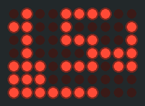
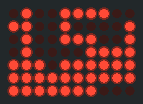
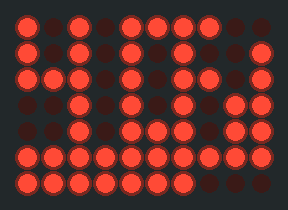

# Follow-Me (FM) — Rider's Guide

**BREmote V2.5-Evo** · tow buggy / eFoil remote

> **Firmware status.** This guide describes the **upcoming release**: the new screens,
> auto-return, the magnet tap and the front stations. It is **available now for testing on the
> [`fm-stations` branch](https://github.com/monterman/BREmote-V2/tree/fm-stations)** (binaries in
> the `latest-FM-stations` folders) and **moves to master after water testing**. Firmware on
> master today still uses the older screens (a bar only, no dots).
>
> Flash the remote and the buggy **together**: the new screens need both sides on the new firmware.
> Download your logs from the buggy before you flash it (see the README, *log format 3*).

**See it move:** [the Follow-Me screens page, with a glance quiz](https://monterman.github.io/BREmote-V2/followme-screens.html)
· **Set it up:** [setup wizard](https://monterman.github.io/BREmote-V2/setup-wizard.html)

---

## 1. What Follow-Me does

After the whip, once you've let go of the rope and you're riding the wave, Follow-Me makes the
**buggy trail you** at a set distance and side, steering itself, so you can watch the wave instead
of the remote.

It is **not** an autopilot. The rule never changes:

> **The buggy moves only while you hold the throttle trigger. Follow-Me only *steers* and only
> *reduces* throttle. It can never add throttle, and letting go of the trigger stops the buggy.**

---

## 2. Safety philosophy

These rules decide every Follow-Me and return feature. They are why the screens and buzzes look the
way they do.

1. **Manual always wins.** If the GPS, the compass or any automatic mode fails, the automation
   switches itself off and hands control back to you. You can always drive the buggy home by hand.
   Manual throttle and steering never depend on GPS, compass, logging or the screen.
2. **"St" is the one "not working" signal.** Something stopped, a mode was refused, a fault: you
   always get **St** on the screen, and a long buzz if you didn't cause it. No other refusal codes
   to learn.
3. **The screen shows only what the buggy confirms.** The remote draws "following" or "coming to
   you" only when the buggy itself reports it. Old data is never shown as live: a distance that is
   not fresh shows `--`, not a frozen number.
4. **Auto-return waits for the rider.** A parked buggy waits while you surf, swim or pump back.
   "Waiting" means a squeeze **will** bring it. If it can't, you get **St** instead of a waiting
   screen.
5. **Arrival keeps a throttle cap until one full release.** When a returning buggy reaches you,
   steering is yours again at once, but the throttle stays limited until you let go of the trigger
   completely once. A buggy that arrives while you're at full throttle can't run into you.

---

## 3. Before you ride

Follow-Me needs:

- a **paired** remote and buggy, both on the new firmware;
- **GPS fix on both**;
- a healthy **radio link**, with telemetry flowing back to the remote;
- a buggy that knows its heading: a **calibrated compass** (`?compasscal`), or GPS course when the
  buggy is moving.

You can *arm* before all of that is ready. The screen shows "not ready" (see §6) and Follow-Me
will not *engage* until it is.

---

## 4. Arming — telling the buggy "I want you to follow"

Arming is a **statement of intent**. It does not move anything.

### 4a. The toggle (works while floating)

1. **LEFT tap, then RIGHT hold** (about 3 s, set by `fm_hold_duration_s`).
2. The remote shows **F1 / F2 / F3** and buzzes **two short taps** = armed.
3. Repeat the gesture before your first squeeze to step the station: **F1 → F2 → F3 → F1**.
   It never lands on "off" by accident.

To switch Follow-Me **off**, make the same gesture after you have ridden. The toggle is your
steering while the trigger is held, so it can't arm mid-tow. That's what the magnet is for.

### 4b. The magnet (works during the tow)

If your remote has the optional Hall sensor ([install tutorial](Hall_Sensor_Install_Tutorial.md))
and `mag_mode` = **4**:

- **Tap** the magnet (under about 0.6 s): arms Follow-Me at your stored station. While following,
  each tap **steps to the next station**. After a step, taps for the next second are ignored, so
  one wobbly tap can't skip two stations.
- **A tap works with the trigger held.** If you forgot to arm, you can do it on the rope.
- In mode 4 the magnet never switches Follow-Me off. Use the toggle gesture for that.

Older magnet modes 1-3 still work (hold about 2 s for Follow-Me, about 5 s for return-to-me, action
on release).

**The arm stays on for the whole session** by default (`fm_arm_timeout_s` = 0). A slow takeoff, a
wait or a swim won't lose it.

---

## 5. The whip — how Follow-Me engages

Follow-Me engages only when **both GPS units prove you have separated**, not on a timer:

1. You're armed, trigger held.
2. You whip and pull away from the buggy.
3. Once you've been **beyond the engage distance for 2 seconds**, the buggy starts following.

Keep the trigger held; no release step is needed.

- **Whip yourself to the side** (classic): you slingshot past and ride away.
- **Steer the buggy away**: keep the trigger and steer the buggy to its side so *it* peels off
  while you carry straight on. Steering during this moment doesn't cancel the arm.

---

## 6. Reading the remote — the new screens

*New in the upcoming release.* Three looks to learn. The bottom of the screen is you.

| Screen | What you see | Meaning |
|---|---|---|
|  | **One dot hopping** between two places, bar scanning | **Waiting.** Armed and ready for your whip. A parked buggy waiting for you to summon it (auto-return) looks **exactly the same**. If the bar **blinks in place** instead of scanning, it's not ready yet (GPS or link still coming). |
|  | **Two steady dots**, bar grows and shrinks with distance | **Following you.** |
|  | **The dot column fills down from the top**, metres count down, bar shrinks from the left | **Coming to you** (auto-return or manual return-to-me). |

**The numbers** are the **metres between the remote and the buggy** (`fm_display_mode` 2, the new
default): `X.X` under 10 m, whole metres up to 99 m, `FAR` beyond that, and `--` when there's no
fresh distance.

**"St"** for 2 seconds = something stopped or was refused. Then the screen shows the true state:
the normal screen (Follow-Me off) or the waiting screen (still armed).

**Blinking "E 7"** = water inside the buggy. **Blinking "St"** = the remote's throttle input has
failed (see README); the buggy gets zero throttle.

Try the [glance quiz](https://monterman.github.io/BREmote-V2/followme-screens.html): can you tell
the three apart in a fraction of a second?

### Buzzes (kept to a minimum)

Fewer buzzes means each one gets noticed. Riding cuts how much you feel a buzz, so only the
important events buzz.

| Buzz | Means |
|---|---|
| **two short taps** | armed |
| **one long buzz** + **St** | stopped, refused or a fault |
| **five short** | link to the buggy lost |
| **five long** + **E 7** | water in the buggy |
| **two short**, out of the blue (not after a gesture) | weak signal or low battery |
| **two medium pulses** while holding the magnet | let go now to start the manual return-to-me |

**No buzz** for: distance changes, a station step, or the start of following. Look at the screen
for those.

---

## 7. Stations — where the buggy follows

Stations are **relative to you**, facing your direction of travel:

| Station | Name | Buggy sits |
|---|---|---|
| **F1** | Near-Right | behind and to your right |
| **F2** | Behind (default) | straight behind you |
| **F3** | Near-Left | behind and to your left |
| **F4*** | Front-Right | ahead and to your right |
| **F5*** | Front-Left | ahead and to your left |

**Station tips:** many **regular-stance** riders like **F1 (behind-right)** and **goofy** riders
**F3 (behind-left)**, so the buggy stays on the side you can see without turning your head.

The angle of F1/F3 is `near_diag_offset_deg` off straight-behind (45 = diagonal; bigger = more
beside you, smaller = more behind you). Follow distance is a separate setting (§10).

### Front stations F4 / F5 — \* in development and testing

*\* New in the upcoming release, not yet water-tested. Expect changes.* The buggy firmware supports
them; picking F4/F5 from the remote comes in a later remote update.

Meant for **downwind runs**, where you want the buggy ahead of you instead of behind.

- **Never dead ahead.** Only ahead-left or ahead-right. A buggy on your line would have to speed
  up as you close on it, and a dead motor would stop it in your path.
- **Side margin:** about 13 m (43 ft) to the side of your line, never closer than 35° to straight
  ahead.
- **Extra distance ahead:** your follow distance plus `fm_front_ahead_extra_m` (default 7 m / 23 ft).
- **Protection cone:** the buggy never cuts across your projected path. Once you're above about
  7.5 mph (12 km/h) the cone reaches about 5 seconds ahead of you, up to 30° each side, and gets
  narrower as you go faster (you ride straighter). A 3 m (10 ft) circle protects you when you're
  slow.

---

## 8. Auto-return — summon the parked buggy

*New in the upcoming release.* On by default (`fm_return_mode` = 1, buggy setting).

1. **You stop or fall.** The buggy stops and **parks**. The screen shows **waiting** (one dot
   hopping), the same look as armed.
2. **It waits.** Surf a few waves, swim, pump back. Being busy for a minute or more doesn't cancel
   it.
3. **Squeeze the trigger** when you want it. The buggy turns toward you and comes back. The screen
   switches to **coming to you** (fill-down, metres counting down).
4. **Pause and squeeze again** as often as you like. Let go to see if it's aiming right, squeeze
   gently for a better turn. A release or a pause never cancels the return.
5. **Steering helps, it doesn't cancel**, with `steer_during_auto` = 1 (take over). Push the stick
   to steer it around a wave; centre it and the buggy aims at you again. With the default 0
   (cancel), a held push still ends the return.

**Auto-return ends only by:**

- **arriving** at you: steering is yours at once, throttle **stays capped until one full release**;
- **a fault**: **St** + long buzz, manual control comes back;
- **switching the remote off and on**: the buggy notices and won't resume on its own;
- switching Follow-Me off with the toggle gesture.

**"Waiting" means it will work.** If the buggy itself can't do it (its own GPS, its heading, a
fault) the return ends straight away with **St**. If only the remote's side is briefly missing
(your GPS, a short link drop), the bar blinks in place (not ready); squeeze then and you get St.

If you catch a wave while it's coming back, the return ends. Let go of the trigger fully, squeeze
again, and once the buggy sees you moving away it follows.

---

## 9. Manual return-to-me (RTM)

A separate mode for calling the buggy when Follow-Me isn't armed.

- **Start it with the trigger released:** RIGHT tap, then LEFT hold, or (mag_mode 4) **hold the
  magnet 2.5 s** until two medium pulses, then let go.
- The screen shows **"rn"**. Confirm with the trigger (a squeeze held about 0.5 s, or a double
  squeeze if `rtm_double_squeeze_en` = 1).
- **Changed your mind?** Hold the toggle **LEFT for 1 second** (pushed past half way) during the
  "rn" window: back to full manual at once, **St**.
- If return-to-me can't start (switched off, no GPS) you get **St**.
- Arrival works like auto-return: steering back at once, throttle capped until one full release.

**Gestures need a released trigger.** The return gesture and the 2.5 s magnet hold only start with
the trigger fully released, so steering or nudging a buggy while you hold the trigger never starts
or ends a return by accident. The one exception: a **magnet tap** still arms Follow-Me with the
trigger held.

---

## 10. Holds vs stops

| Situation | What it is | What happens | Re-arm? |
|---|---|---|---|
| You release the trigger | deadman | motor stops | no |
| You fall, slow down or get too close | a **hold** (normal) | buggy stops, stays armed; parks for auto-return if it's on | no |
| GPS, compass or radio drops out | a **fault** | **St** + long buzz, manual control back | yes |

Falling is normal, so it stays ready. A real failure is not, so it steps fully out and waits for
you to arm again. Autonomy never silently restarts after a glitch.

---

## 11. Settings

| Setting | Board | What it does | Default |
|---|---|---|---|
| `fm_display_mode` | remote | what the numbers show while armed: 2 = metres to the buggy | **2** (new) |
| `mag_mode` | remote | magnet role: 0 off, 1 FM, 2 RTM, 3 FM + RTM, **4 tap = FM / station, hold = return-to-me** | 0 |
| `fm_hold_duration_s` | remote | how long the RIGHT hold of the arm gesture is | 3 s |
| `fm_arm_timeout_s` | remote | auto-disarm after this long with no throttle; 0 = never | 0 |
| `fm_warn_distance_m` | remote | distance that fills the bar (full scale) while following. It no longer buzzes. | 150 m |
| `followme_mode` | buggy | station names 1-5 (the remote sends the station) | 2 |
| `near_diag_offset_deg` | buggy | F1/F3 angle off straight-behind | 45 |
| `min_dist_m` | buggy | closest the buggy may get while following; throttle cut inside it | 10 m |
| `followme_smoothing_band_m` | buggy | slow-down band above `min_dist_m`; follow distance = both added | |
| `fm_return_mode` | buggy | auto-return when you stop: 1 on, 0 hold where it is | **1** (new) |
| `steer_during_auto` | buggy | stick during automatic steering: 0 cancel, 1 take over | 0 |
| `fm_front_ahead_extra_m` | buggy | extra metres ahead for F4/F5 (4-10; 0 = 7 m) | 0 |

The [setup wizard](https://monterman.github.io/BREmote-V2/setup-wizard.html) picks these for your
setup and gives you a config to paste. Review it before you ride.

---

## Safety summary (never changes)

1. The buggy moves only while you hold the throttle trigger.
2. Follow-Me and return modes only steer and only reduce throttle. They never add.
3. Releasing the trigger stops the buggy, in every mode.
4. Manual control always works, even if GPS, compass or radio fail.
5. "St" means not working. "Waiting" means it will work.

---

## Credits

- **Ludwig** — BREmote's author: the original remote, the radio code this fork keeps merging from
  upstream, and the battery tools at [lbre.de/BREmote](https://lbre.de/BREmote/).
  Setup video: [youtu.be/r6JIZEq3aTU](https://youtu.be/r6JIZEq3aTU).
  Upstream repo: [github.com/Luddi96/BREmote-V2](https://github.com/Luddi96/BREmote-V2).
- **Heiguga** — Follow-Me ideas, including the front stations.

*See `BUGGY_FOIL_DOMAIN.md` for the domain model and `DESIGN_FOLLOW_ME.md` for the engineering
design.*
