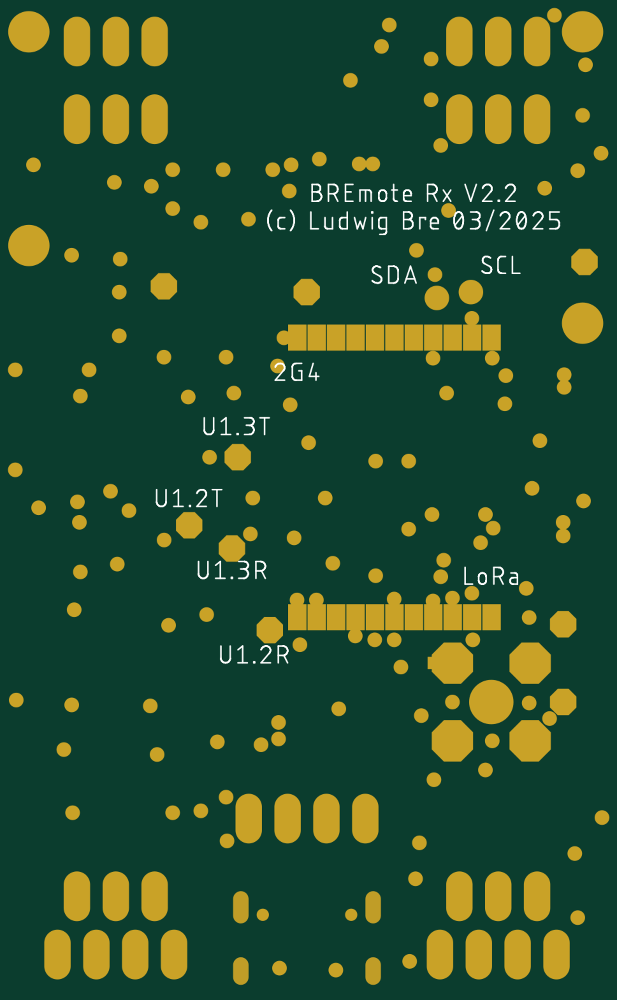

# BN-880 → RX Wiring (GPS + Compass)

**Applies to:** V2.5-Evo RX (HT-CT62 / ESP32-C3) with a **BN-880** GPS module.
**Why the BN-880:** it carries a **QMC5883L magnetometer**. The RX needs a compass for
**Return-to-Me** and **Follow-Me** heading — a BN-220 has no compass and cannot run those modes.

> This covers the **module-to-board** wiring only. Waterproof connectors and pack wiring are
> deliberately not covered — everyone uses different connectors, so pick your own and keep the
> signal mapping below.

---

## Pin map — the six wires

The RX board's pads are labelled on the silkscreen — **wire label to label**. The GPIO numbers below
are only for reference when you need them; they are not what you wire to.

Four wires go to the **`UART 1.1` header** (the right-hand one — see below). The other two, `SDA` and
`SCL`, go to bare pads on the **underside** of the board.

| BN-880 pad | RX board pad | GPIO behind it | Notes |
|---|---|---|---|
| **VCC** | `V+` on `UART 1.1` | — | **5 V** — put that header's selector on `5V`, not `3V3` |
| **GND** | `GD` on `UART 1.1` | — | Common ground with the RX |
| **TX** | **`TX`** on `UART 1.1` | 19 | **straight** — label to label |
| **RX** | **`RX`** on `UART 1.1` | 18 | **straight** — label to label |
| **SCL** | `SCL` pad — **underside** | 1 | straight |
| **SDA** | `SDA` pad — **underside** | 2 | straight |

> **The `SDA` and `SCL` pads are on the BOTTOM of the board**, just north of the ESP32-C3 module —
> two bare round pads sitting immediately above its antenna castellations, under the
> `(c) Ludwig Bre` silkscreen. They are labelled `SDA` and `SCL` on the bottom silkscreen. Flip the
> board over to find them; there is nothing to see on the top side.

## Nothing crosses. Wire label to label.

`TX`→`TX`, `RX`→`RX`, `SCL`→`SCL`, `SDA`→`SDA`. **The board already does the crossover for you.**

This is the opposite of the usual serial convention, so it is worth knowing *why*, and the board
files prove it rather than asserting it. Tracing the `UART 1.1` header back through the mux to the
ESP32-C3 in `Rx_V2-2.sch`:

```
pad `RX` (JP9.2) ── Q2 ── U1_1_RX ── IC6 mux 1Y1→1Z ── HT-CT62 pin G18   = GPIO 18
pad `TX` (JP9.3) ── Q5 ── U1_1_TX ── IC6 mux 2Y1→2Z ── HT-CT62 pin G19   = GPIO 19
```

and the firmware opens the port as:

```c
Serial1.begin(baud, SERIAL_8N1, P_U1_RX, P_U1_TX);   // GPS.ino
#define P_U1_TX 18                                   // BREmote_V2_Rx.h
#define P_U1_RX 19
```

So the ESP32 **transmits on GPIO 18 and receives on GPIO 19** — which means the pad silkscreened
**`RX` is driven by the board's transmitter**, and the pad silkscreened **`TX` is the board's
receiver input**.

The silkscreen is therefore naming **what you connect there**, not the signal the pin carries. Pad
`RX` wants the module's `RX`. That is why Ludwig's original diagrams show a direct connection: the
crossover is designed into the PCB, so doing it again in the cable un-does it.

> **A naming trap, if you ever read the schematic yourself.** The schematic net called `P_U1_RX`
> lands on GPIO 18, while the firmware's `#define P_U1_RX` is 19 — the same name means opposite
> things in the two files, because the schematic names nets from the *peripheral's* point of view.
> The physical trace above is what settles it.

### Which header — `UART 1.1`, the right-hand one

The board has **two UART headers**. They are *not* two independent serial ports: they are one
hardware UART (`Serial1`) shared between two connectors by a 74HC4052 analog mux, which the firmware
flips back and forth. That is what the `.0` and `.1` in the silkscreen mean — **UART1, mux channel 0
and mux channel 1**.

```
   UART 1.0                UART 1.1
    5V   3V3                5V   3V3      <- supply selector (GPS: 5V)
   V+  RX  TX  GD          V+  RX  TX  GD
   └──── VESC ────┘        └──── GPS ─────┘
```

| Header | Mux channel | Peripheral |
|---|---|---|
| `UART 1.0` | 0 | **VESC** |
| `UART 1.1` | 1 | **GPS** — wire the BN-880 here |

Straight from the firmware (`Source/V2_Integration_Rx/System.ino`, `setUartMux()`):

```
//   channel 0 (VESC): MUX_0 = LOW,  MUX_1 = LOW
//   channel 1 (GPS):  MUX_0 = HIGH, MUX_1 = LOW
```

The board files agree. In `Electronics/github_public/Rx/Rx/Rx_V2-2.sch` the two 1×4 headers carry
nets named `UART_1_0_RX` / `UART_1_0_TX` (header `JP5`) and `UART1_1_RX` / `UART1_1_TX` (header
`JP9`) — the silkscreen is naming the net, and the net is naming the mux channel.

Each header's supply selector is a **3-pin jumper** (`JP7` for `1.0`, `JP10` for `1.1`): the middle
pin feeds that header's `V+` pad, and you bridge it to one side or the other. For the BN-880,
bridge it to the **5 V** side.

⚠️ **Wire the GPS into `UART 1.0` and it will never work** — that connector is on the VESC channel,
so the module's bytes are switched away from the UART. The symptom is identical to a TX/RX swap:
nothing at any baud from `?gpsbaud`. Confirm you are on the **right-hand header** before you start
swapping data wires.

### Power the BN-880 from 5 V — not 3.3 V

Each UART header has its own **`5V` / `3V3`** selector. On `UART 1.1` it goes on **`5V`**.

The BN-880 is a 5 V module: it has an onboard regulator that drops 5 V to the 3.3 V its u-blox core
and QMC5883L need. Run it from the 3.3 V rail instead and you sit right on the regulator's dropout —
which does not fail cleanly. You get a module that boots, enumerates, sometimes even reports sats,
then browns out under the current draw of an acquisition burst. That reads as flaky GPS, not as a
power problem, and it will waste a day.

The reference build takes **5 V off the VESC's 5 V output**. That is the known-good arrangement.

**The data lines are still 3.3 V logic**, even with a 5 V supply — the module's UART TX and its I2C
lines run at the internal 3.3 V rail. No level shifter is needed between the BN-880 and the
ESP32-C3, and nothing on the board sees 5 V on a signal pin.

> The `3V3` position on the selector exists for modules that want 3.3 V — the HGLRC M100 series,
> for example, accepts 3.3–5 V. It is not the right setting for a BN-880.

> ### Bench-check it before you seal anything up
>
> Straight is what the board files, the firmware and Ludwig's own diagrams all say — but confirm it
> on your unit before it goes anywhere near water. Board revisions vary, and this costs two minutes:
>
> 1. Wire it **straight** on the **`UART 1.1`** header — `TX`→`TX`, `RX`→`RX`.
> 2. Power up and run **`?gpsbaud`** — a listen-only baud scan that reports whether *any* bytes are
>    arriving. No sky and no fix needed, so it answers the wiring question on its own.
> 3. **Bytes at some baud → correct.** Confirm outdoors with `?printgps` for sats and a position.
> 4. **Nothing at any baud →** swap just the two data wires and run `?gpsbaud` again. Swapping UART
>    data lines cannot damage anything — both ends are 3.3 V logic — so this is a free test.
> 5. Whichever way returns bytes is correct for your board. If it turns out to be the swapped one,
>    please open an issue saying so; that would mean a revision differs from the files.
>
> The same applies to the VESC on `UART 1.0` — probe that one with `?vescraw`, then `?vescping`.

```
        BN-880 module                    RX board — UART 1.1 header (GPS)
   ┌──────────────────────┐                 ┌──────────────────────────────┐
   │                      │                 │                              │
   │  VCC  ───────────────┼─── red ────────►│  V+    selector on 5V        │
   │  GND  ───────────────┼─── black ──────►│  GD                          │
   │                      │                 │                              │
   │  TX   ───────────────┼─── straight ───►│  TX    (GPIO 19)      UART   │
   │  RX   ◄──────────────┼─── straight ────┤  RX    (GPIO 18)      UART   │
   │                      │                 │                              │
   │  SCL  ───────────────┼─── straight ───►│  SCL   pad, underside        │
   │  SDA  ───────────────┼─── straight ───►│  SDA   pad, underside        │
   │                      │                 │                              │
   └──────────────────────┘                 └──────────────────────────────┘
       GPS + QMC5883L                         compass answers at 0x0D

        SDA and SCL are bare pads on the BOTTOM of the board, north of
        the ESP32-C3 — not on the UART header. Flip it over.

              every wire goes label to label — nothing crosses
             (the board does the UART crossover internally)
```

Wire colours vary between vendors — **go by the silkscreen labels on the module**, not by colour.

### Where the `SDA` / `SCL` pads are — on the underside

**Flip the board over.** They are two bare round pads on the **bottom** side, just **north of the
ESP32-C3 module** — immediately above its 2.4 GHz antenna castellations, directly under the
`(c) Ludwig Bre 03/2025` silkscreen. Both are labelled on the bottom silkscreen.



*Bottom silkscreen and soldermask, rendered from `Rx_V2-2_Gerber.zip` and mirrored so it reads the
way it does with the board flipped over in your hand.*

```
                 bottom side, as you look at it
        ┌───────────────────────────────────────────┐
        │        BREmote Rx V2.2                    │
        │        (c) Ludwig Bre 03/2025             │
        │                                           │
        │            SDA ●     ● SCL                │  <- the two pads
        │        ▄▄▄▄▄▄▄▄▄▄▄▄▄▄▄▄▄▄▄▄▄              │
        │            2G4  (antenna castellations)   │
        │                                           │
        │        U1.3T ●   U1.2T ●                  │  <- spare UART pads
        │        U1.3R ●   U1.2R ●                  │     (mux ch 2 and 3)
        └───────────────────────────────────────────┘
```

| Pad | Diameter | Position from the board's top-left corner |
|---|---|---|
| `SDA` | 1.6 mm | 11.5 mm in, 19.3 mm down |
| `SCL` | 1.6 mm | 9.3 mm in, 18.9 mm down |

They are 2.2 mm apart, so use a fine tip. **Nothing is exposed on the top side** — do not go looking
for them there.

**Why they are not in the schematic.** They are bare pads dropped onto an existing signal in the
*layout*, not a component, so no device appears on the `.sch` sheet — tracing nets there finds only
the AW9523 expander, the pull-ups and the module, and no connector. Ludwig's own changelog records
when they were added:

```
Changelog Rx
V2.2:
- Change supply for CH340K to before USB diode
- Add SDA and SCL pads
```

So **a V2.1 board does not have them and a V2.2 does.** Check which revision you have — it is printed
on the bottom silkscreen. Positions above were read from `Rx_V2-2_Gerber.zip` (bottom silkscreen and
soldermask layers), which is the authority for anything that exists only in the layout.

---

## After wiring — three things, in this order

### 1. Tell the firmware which module you fitted
The RX must be told it has a BN-880, or it will not configure the module correctly:

```
?set gps_chip_type 1        # 0 = BN-220, 1 = BN-880, 2/3 = M10
?save
```
Reboot after saving.

### 2. Check the build setting that shares these pins
The ESP32-C3 USB peripheral claims **GPIO 18/19** — the same pins the GPS uses. If you compile it
yourself, **USB CDC On Boot must be Disabled** (`Tools → USB CDC On Boot → Disabled`, or
`:CDCOnBoot=default` on the arduino-cli FQBN). The firmware refuses to build otherwise. Prebuilt
`.bin` files are already correct.

### 3. Verify before you trust it
```
?gpsbaud      # listen-only: are any bytes arriving at all? (answers the wiring question)
?printgps     # sats, fix and position = the link is working end to end
?magtest      # EMI test + verdict - BUCKET/DOCK, motor MUST be loaded (see Mounting)
?compasscal   # full calibration — rotate the buggy through a complete horizontal circle
```
No bytes at any baud is a **UART orientation** problem — swap the two data wires and retest (see the
note above). Compass not found at `0x0D` is almost always **SDA/SCL swapped** or a bad ground.

---

## Mounting — this matters more than people expect

The magnetometer sits in the same module as the GPS, and **motor phase wires and battery leads
throw the heading off by 100°+ at throttle**. On the RX a bad heading is a Follow-Me fault, not a
cosmetic problem.

- Mount the BN-880 **square to the buggy** — its own forward axis lined up with the nose, or turned
  exactly 90°, 180° or 270° from it. **Not diagonal.** The firmware stores the mounting rotation only
  as one of those four values, so a module at, say, 30° gets stored as 0° and keeps 30° of heading
  error that no calibration can remove.
- Mount the BN-880 **as far from the battery and phase wires as the build allows**. Two inches
  makes a large difference at close range.
- **Never mount it over a loop or U-turn in the phase wires.** This is the single worst position
  and it is easy to create by accident. Out-and-back conductors cancel each other's field *at a
  distance*, but at the centre of the loop they **add** — a current loop behaves like a magnet, and
  its field there is far stronger than a straight wire at the same spacing. If the module sits
  above where the phase wires turn back on themselves, fix that before anything else.
- **Twist the phase wires into a tight bundle.** Paired conductors cancel, and the leftover field
  then falls away much faster with distance than a single wire's does. This can buy more than
  moving the module.
- Keep it away from ferrous hardware and anything carrying high current.
- Run `?magtest` **in place, on the real build, WITH THE MOTOR UNDER LOAD** — prop in a bucket of
  water or held against the dock. ⚠️ **Never judge it free-spinning.** The same buggy measured
  +3-5° free-spinning and **87-101° under load** — seven times worse. A free-spinning prop draws
  almost no current and reads clean on a compass that is useless in the water. `?magtest` now
  refuses to grade a run whose peak current stayed under 5 A, and prints a verdict at the end.
- **Re-run `?compasscal` after any change** to module, position, or mounting. A stored calibration
  does not carry over: different module, different mounting, different hard/soft-iron offsets.

---

## Related

- [GPS configuration, baud rates and dynamic model →](GPS.md)
- [GPS troubleshooting →](hardware/gps-troubleshooting.md)
- [Follow-Me guide →](FOLLOW_ME_GUIDE.md)
- [RX flashing guide →](FLASHING_RX_ARDUINO.md)
